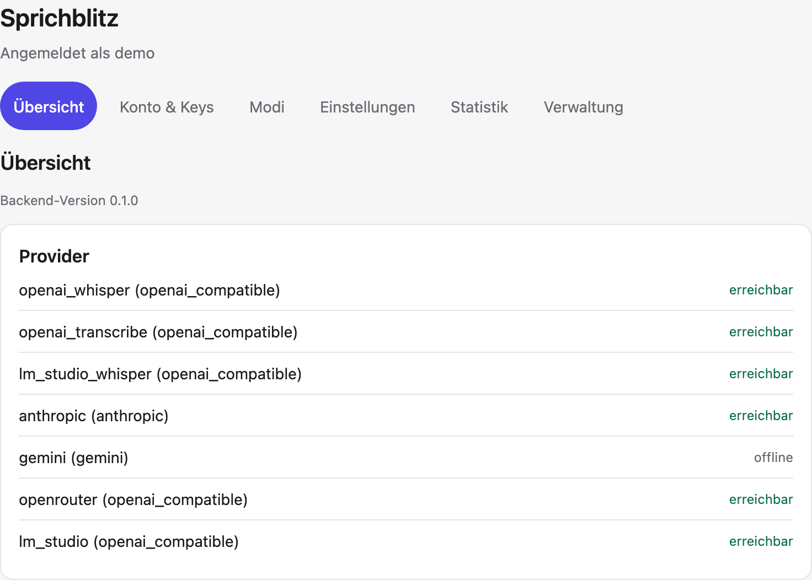
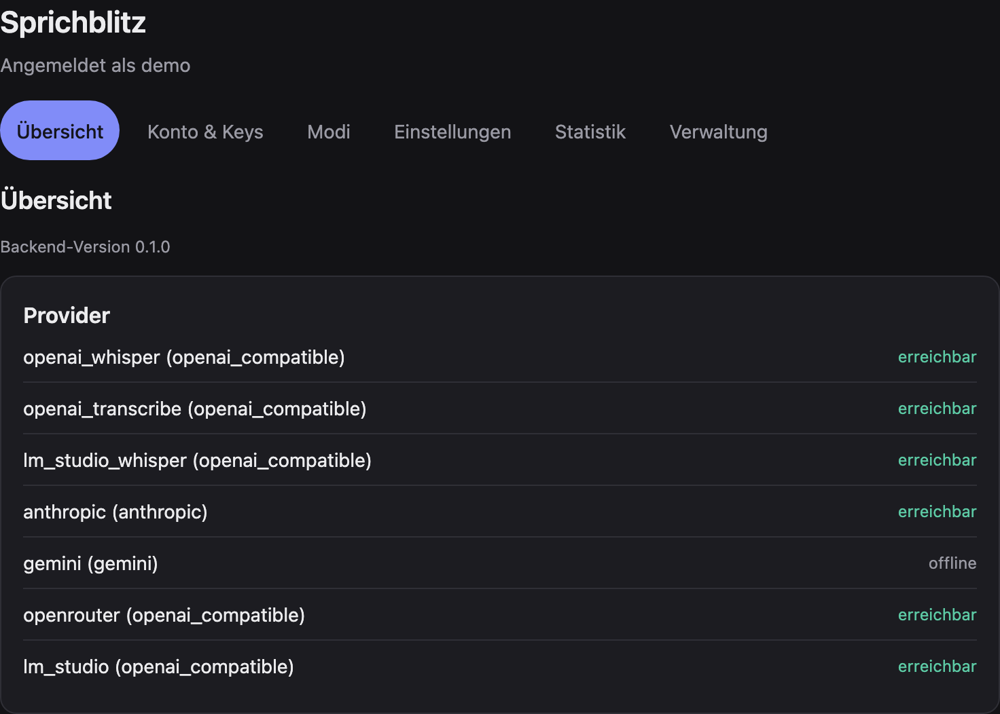
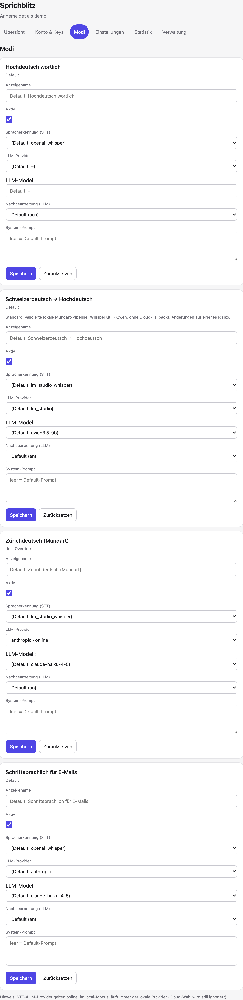
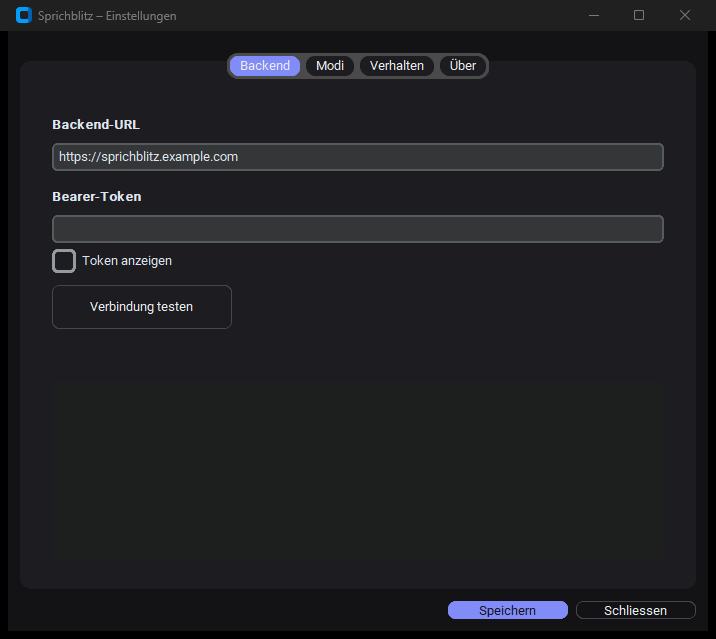

# Sprichblitz

> **Sprichblitz** ist eine eigenständige Reinterpretation der
> „Blitztext"-Idee von Christoph Magnussen (YouTube, April 2026). Dank an
> Christoph für die ursprüngliche Idee und dafür, dass er seine eigene
> Implementierung offen freigegeben hat:
> https://github.com/cmagnussen/blitztext-app

System-weites Diktier-Tool, persönlich und selbstgehostet.
Sprich – der Text landet dort, wo du ihn brauchst. Schneller als Tippen,
präziser als die Built-in-Diktierfunktion von Windows oder Android.

Eine eigenständige Reinterpretation mit Multi-Provider-Backend und
Multi-Plattform-Clients.

## Was es gibt

| | |
|---|---|
| **Backend** | FastAPI, per Docker oder nativ – läuft auf beliebiger Plattform. Mehrbenutzer-fähig: eigene Tokens, eigene API-Keys, eigene Modus-Einstellungen. |
| **Windows-Client** | Tray + globale Hotkeys. Sprich, und der Text erscheint an der Cursor-Position. Portable `.exe`, keine Adminrechte. |
| **Android-Client** | Aufnahme-Knopf → Text in der Zwischenablage + Android-Share-Sheet. Kotlin/Compose, Sideload. |
| **Web-Konsole** (`/app`) | Läuft im Backend, wird aus den Clients heraus geöffnet: Keys, Modi, Statistik – und für Admins Nutzer- und Modus-Verwaltung. |

```
   ┌─ Windows-Client (Tray, Hotkey) ──────┐
   │  Hotkey ─► Mikro ─► WAV ─► POST /full │
   │  ◄── Text an die Cursor-Position      │
   │                                        ├── HTTPS ─►  ┌──────────────────────┐
   ├─ Android-Client (Compose) ────────────┤              │  FastAPI-Backend     │
   │  Knopf ─► Mikro ─► .m4a ─► POST /full │              │  Self-hosted server │
   │  ◄── Text in Zwischenablage + Teilen   │              │  sprichblitz         │
   │                                        │              │  .example.com        │
   └─ beide öffnen die Web-Konsole (/app) ─┘              └────────┬─────────────┘
      im WebView – der Bearer bleibt draussen                      │
                                                    ┌──────────────┴───────────────┐
                                                    │                              │
                                            STT-Provider                    LLM-Provider
                                      ────────────────────             ────────────────────
                                      • OpenAI Whisper                 • Anthropic (Haiku)
                                      • gpt-4o-transcribe              • Gemini Flash
                                      • WhisperKit (lokal, Mundart)    • OpenRouter
                                      • Speechmatics (Stub)            • LM Studio (Qwen)
                                                                       • OpenAI (GPT-4o)
```

Das Backend routet jeden Request je nach **Modus** an unterschiedliche
STT- und LLM-Provider:

| Modus | STT | LLM-Postprocessing |
|---|---|---|
| `exact_de` | Cloud-Whisper (Hochdeutsch) | – |
| `exact_swiss` | WhisperKit (lokal, Mundart), Fallback Cloud | Qwen → Hochdeutsch |
| `mundart` | WhisperKit (lokal, Mundart), Fallback Cloud | LLM → geschriebenes Zürichdeutsch |
| `mail` | Cloud-Whisper | Anthropic Haiku → schriftsprachlich |
| `rage` | Cloud-Whisper | Anthropic Haiku → höflich |
| `emoji` | Cloud-Whisper | LM Studio Qwen → Emojis |

Die Tabelle zeigt die mitgelieferte Grundkonfiguration. **Modi sind reine
Konfiguration** – neue anlegen, bestehende umbauen oder abschalten geht in der
Web-Konsole, ohne Code und ohne Neustart.

> **Naming-Hinweis:** Der lokale STT für `exact_swiss` läuft über **WhisperKit**
> (eigener Daemon auf `:8080`). Der Config-Provider heisst aus historischen
> Gründen `lm_studio_whisper` – das ist **nicht** LM Studio. LM Studio (`:1234`)
> bedient nur das lokale **LLM** (Qwen).

## Screenshots

Die **Web-Konsole** (`/app`) – Self-Service für Keys, Modi und Statistik, plus
Admin-Verwaltung. Hell/dunkel folgt der Systemeinstellung
([Design-System](docs/design_system.md)); die nativen Clients spiegeln dieselben
Farben/Abstände.

<p align="center">
  
  
</p>
<p align="center"><em>Übersicht mit Provider-Health – hell und dunkel, ganz ohne Umschalter.</em></p>

<p align="center">
  
</p>
<p align="center"><em>Modi-Editor: STT-/LLM-Provider, Modell und Prompt pro Modus – per Nutzer editierbar.</em></p>

<p align="center">
  
</p>
<p align="center"><em>Windows-Client: Einstellungen (Backend-URL + Token); der Text landet an der Cursor-Position.</em></p>

## Wie es zusammenhängt (und was wo laufen muss)

Sprichblitz besteht aus **drei Ebenen**, die unabhängig voneinander platziert
werden können – auf einer Maschine oder verteilt:

```
Ebene 1 · BACKEND  (Pflicht, läuft überall)
  FastAPI. Nimmt Audio, routet je Modus an einen STT- und optional einen
  LLM-Provider, gibt Text zurück.  →  Docker (Linux/macOS/Windows) oder Python 3.11+.

Ebene 2 · PROVIDER  (pro Modus wählbar: Cloud ODER lokal)
  Cloud  – OpenAI Whisper / gpt-4o-transcribe (STT), Anthropic / Gemini /
           OpenRouter / OpenAI (LLM). Nur ein API-Key, nichts zu installieren.
  Lokal  – WhisperKit (STT) und LM Studio (LLM) auf einem eigenen Gerät.
           Hält Audio & Text auf der Hardware.

Ebene 3 · CLIENTS
  Windows-Tray · Android-App · Web-Konsole (im WebView). Reden nur mit dem Backend.
```

**Der schnellste Weg ist reine Cloud:** Backend starten, in der Web-Konsole pro
Nutzer die API-Keys hinterlegen – `exact_de`, `mail`, `rage` laufen sofort, ohne
irgendetwas Lokales, **ohne Mac**. Lokale Provider sind **optional** und nur für
zwei Dinge da: die Schweizerdeutsch-Modi (`exact_swiss`/`mundart`, brauchen eine
dialektfähige STT) und den „alles bleibt auf dem Gerät"-Datenschutz
(`processing_location: local`).

### Plattform-Matrix

| Komponente | Linux | Windows | macOS Intel | macOS Apple Silicon | Rolle |
|---|:--:|:--:|:--:|:--:|---|
| **Backend** (Docker/Python) | ✅ | ✅ | ✅ | ✅ | Pflicht |
| **Cloud-Provider** (STT+LLM) | ✅ | ✅ | ✅ | ✅ | nur API-Key |
| **LM Studio** (lokales LLM) | ✅ | ✅ | ✅ | ✅ | optional |
| **WhisperKit** (lokale Mundart-STT) | ❌ | ❌ | ❌ | ✅ **nur hier** | optional |

**WhisperKit läuft ausschliesslich auf Apple Silicon** (CoreML/Neural Engine) –
das ist die einzige harte Plattform-Grenze. Wer keinen Apple-Silicon-Mac hat, aber
Schweizerdeutsch lokal will, hängt einen anderen OpenAI-kompatiblen Whisper-Server
in den STT-Slot (z. B. [Speaches](https://github.com/speaches-ai/speaches) /
faster-whisper) – das ist eine Config-Zeile. Ohne lokale STT laufen
`exact_swiss`/`mundart` über den konfigurierten **Cloud-Whisper-Fallback** (etwas
schlechtere Mundart-Qualität, dafür null Setup).

Verteilt oder gebündelt: Die Provider-`base_url` in `config.yml` zeigt jeweils auf
den Host – `localhost` (alles auf einer Maschine), eine LAN-IP (LM Studio auf einem
GPU-PC nebenan) oder `host.docker.internal` (Backend im Container, Provider auf dem
Host). Details: [docs/whisper_local.md](docs/whisper_local.md).

## Komponenten

| Verzeichnis | Inhalt |
|---|---|
| `backend/` | FastAPI-App, Provider-Adapter, Config-Loader, Web-Konsole (`console_static/`), Tests. |
| `windows_client/` | Tray + UI + Hotkeys + Audio + Insertion. |
| `android_client/` | Kotlin/Compose-App (Aufnahme, Einstellungen, Konsolen-WebView). |
| `deployment/launchd/` | macOS-LaunchAgent für Auto-Start des Backends. |
| `deployment/docker/` | Docker-Compose-Setup fürs Backend (gleichwertiger Weg zum LaunchAgent). |
| `docs/` | Architektur, Design-System, Swiss-German-Strategie, Cloudflare-Tunnel, Betrieb, Troubleshooting. |
| `Makefile` | `make help` zeigt alle Targets. |

## Schnellstart

Backend von Null zu „läuft" – nur mit Cloud-Providern, **kein Mac/WhisperKit
nötig**. Läuft nativ (Python 3.11+) oder im Container (Docker).

```bash
# 0. Python-Umgebung + Backend installieren
python3.12 -m venv backend/.venv
backend/.venv/bin/python -m pip install -e "./backend[dev]"

# 1. Config + Secrets
cp backend/config.example.yml backend/config.yml
cp backend/.env.example backend/.env
make setup-token                        # schreibt BACKEND_AUTH_TOKEN in backend/.env
#  → SPRICHBLITZ_SECRET_KEY in .env eintragen (Fernet-Key; Befehl steht in .env.example)

# 2. DB-Schema anlegen + den .env-Token als Admin-Nutzer registrieren
make migrate
backend/.venv/bin/python -m sprichblitz_backend.admin migrate-single-user --location online

# 3. Starten – nativ ODER Docker
make run-backend          # Uvicorn auf :8000
#   oder:  make docker-up  (baut das Image, mountet backend/.env)

curl http://localhost:8000/health        # → {"status":"ok",...}
```

`online` ist der Fresh-install-Default und benötigt keine lokalen Dienste. Wer
WhisperKit und LM Studio eingerichtet hat, kann den Nutzer danach in der
Web-Konsole bewusst auf `local` umstellen.

Die **Provider-API-Keys** hinterlegst du danach pro Nutzer in der Web-Konsole
(`/app`) – **nicht** in der `.env` (es gibt bewusst keinen env-Key-Fallback).

- **Volle Anleitung** (Cloudflare-Tunnel, lokale Provider, Client-Builds):
  **[SETUP.md](SETUP.md)**
- **Docker im Detail:** **[deployment/docker/README.md](deployment/docker/README.md)**
- **Build-Schritte:** **[BUILD.md](BUILD.md)** · **Architektur:**
  **[docs/architecture.md](docs/architecture.md)**

## Tech-Stack

**Backend**
- Python 3.11+ (3.12 in Produktion)
- FastAPI + Uvicorn (bewusst `proxy_headers=False` – die TrustedIngress-Middleware
  braucht den rohen TCP-Peer, siehe [docs/architecture.md](docs/architecture.md))
- Pydantic v2 für Models + Config
- httpx für Provider-Calls, Tenacity für Retries
- Loguru fürs Logging
- begrenzter ffmpeg-Subprozess für Audio-Normalisierung
- pytest + respx für Tests

**Windows-Client**
- Python 3.12 (per `py -3.12`)
- customtkinter für UI, pystray für Tray
- sounddevice (PortAudio) für Audio-Capture
- pywin32 + `keyboard` für Hotkeys, `keyring` für Token-Storage
- pywebview für die Konsole
- PyInstaller für `.exe`-Builds (--onedir Default)

**Android-Client**
- Kotlin + Jetpack Compose, ein App-Modul (`io.github.mikkey12.sprichblitz`)
- minSdk 26 / targetSdk 36, Sideload (kein Play Store)
- OkHttp + kotlinx.serialization
- `EncryptedSharedPreferences` fürs Token, WebView für die Konsole
- Berechtigungen: nur `RECORD_AUDIO` + `INTERNET`

**Web-Konsole**
- Vanilla-JS ohne Build, strikte CSP (kein Inline, keine externen Ressourcen)
- Design-Tokens in `style.css`, siehe [docs/design_system.md](docs/design_system.md)

**Referenz-Deployment** (ein Beispiel – nichts davon ist Pflicht, siehe
Plattform-Matrix oben)
- Backend nativ auf einem Apple-Silicon-Mac (alternativ: Docker auf beliebigem Host)
- WhisperKit-Daemon auf `:8080` (lokale Mundart-STT, **nur Apple Silicon**)
- LM Studio auf `:1234` (lokales Qwen-LLM, plattformübergreifend)
- Cloudflare Tunnel auf separater Domain (`sprichblitz.example.com`)

## Datenschutz

- Sprichblitz legt kein dauerhaftes Audioarchiv an. Beim Multipart-Parsing kann
  Starlette grössere Uploads kurzzeitig in das Betriebssystem-Tempverzeichnis
  spoolen; Android zeichnet vor dem Upload eine App-private temporäre `.m4a`
  auf. Beide Pfade sind kurzlebig und werden nicht als Nutzdaten gespeichert.
- Logs enthalten Metadaten (Mode, Provider, Latenz), niemals Audio
  oder Transkripte.
- API-Keys pro Nutzer verschlüsselt in der Datenbank (Fernet-Vault), nicht
  im Code.
- Bearer-Token statt offenem Endpoint; im Keystore des jeweiligen Systems
  (Windows Credential Manager, Android `EncryptedSharedPreferences`).
  In der Datenbank liegt nur ein SHA-256-Hash.
- Cloudflare Tunnel stellt den öffentlichen HTTPS-Transport bereit; die
  Anmeldung der nativen Clients erfolgt ausschliesslich mit dem Backend-Bearer.
- Die Web-Konsole bekommt den Token **nie** zu sehen: der native Client
  tauscht ihn gegen einen kurzlebigen, an einen Client-Nonce gebundenen
  Einmal-Code; die WebView erreicht nur
  ein HttpOnly-Session-Cookie. Ein Token-Widerruf beendet solche Sitzungen
  sofort.
- Lokale Modi halten Audio **und** Text in der selbst betriebenen Infrastruktur:
  Der native Client sendet die Aufnahme weiterhin an das eigene Backend, dieses
  nutzt dann WhisperKit und LM Studio statt Cloud-Providern. Ein Schalter pro
  Nutzer (`processing_location=local`) erzwingt das für alle Modi.

## Nicht gebaut

- Mac-Client (MenuBar).
- PWA als Browser-Fallback, falls der Geschäfts-PC die `.exe` blockiert.

## Lizenz

MIT, Copyright © 2026 Sprichblitz contributors. Siehe [LICENSE](LICENSE).

Fehlerbehebungen und Verbesserungen sind willkommen; der lokale Prüfablauf steht
in [CONTRIBUTING.md](CONTRIBUTING.md). Sicherheitslücken bitte nicht als
öffentliches Issue melden, sondern nach [SECURITY.md](SECURITY.md).

## Credits / Danksagung

> **Sprichblitz** ist eine eigenständige Reinterpretation der
> „Blitztext"-Idee von Christoph Magnussen (YouTube, April 2026). Dank an
> Christoph für die ursprüngliche Idee und dafür, dass er seine eigene
> Implementierung offen freigegeben hat:
> https://github.com/cmagnussen/blitztext-app

- **OpenAI**, **Anthropic**, **Google**, **OpenRouter** und das
  **LM-Studio-/Qwen-Team** für die zugrundeliegenden Modelle.
- **Claude Code** und **OpenAI Codex** als Entwicklungswerkzeuge.
